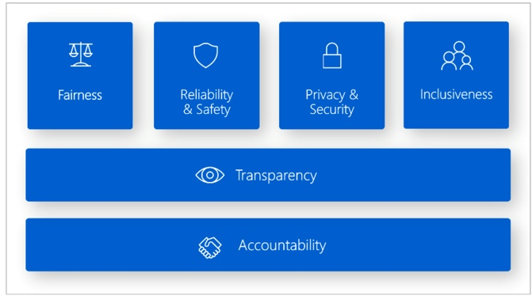
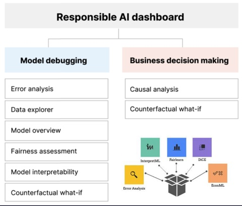

# Azure ResponsibleAI Dashboard Guide

## Introduction
Welcome to the documentation for Microsoft Azure Responsible AI Dashboard! This tutorial will show you how to leverage Azure's Responsible AI tools and features to make sure your projects employ morality and responsibility when using AI.


## Table of Contents
1. [Overview](#overview)
2. [Getting Started](#getting-started)
    - [Prerequisites](#prerequisites)
    - [Installation](#installation)
3. [Examples](#examples)
    - [Classification Model](#classification-model)

## Overview

Today's AI innovation and adoption are happening at a never-before-seen pace. Daily innovation is made possible by open-source groups and tools. Organizations producing AI-driven solutions are driving adoption, which in turn is increasing user expectations (and concerns) that AI operates consistently, safely, and responsibly. Governments are responding by formulating legislation to assist protect the public's faith in these solutions. Microsoft has defined 6 principles for Responsible AI.




### Responsible AI Dashboard

The Responsible AI dashboard provides a unified interface to core open-source tools from Microsoft and the community that can help AI practitioners assess how well their models follow those principles as presented in the figure below.




### Microsoft Responsible AI Team

Microsoft's ResponsibleAI initiative is supported by a devoted group of people who are working to advance moral AI practices. Important team players include:

- **Ruth Yakubu:** [GitHub](https://github.com/ruyakubu)
- **Nitya Narasimhan:** [GitHub](https://github.com/nitya)


## Getting Started
### Prerequisites
- Basic knowledge of Python programming
- Github account
- Azure Subscription

### Installation

#### Option 1: Working on the Local Machine

1. **Clone the Repository:**
   ```
   git clone https://github.com/nguefackuriel/ResponsibleAI-Dashboard-Guide
   cd ResponsibleAI-Dashboard-Guide/lib
   ```

2. **Create Conda Environment and install Dependencies:**
   ```
   conda env create -f environment.yml -n RAI_DASHBOARD
   ```

3. **Activate Conda Environment:**
   ```
   conda activate RAI_DASHBOARD
   ```

4. **Connect to your Azure account:**
   ```
   az login --use-device-code
   ```
5. **Install the ml extension:**
   ```
   az extension add -n ml
   ```
6. **Create AML workspace by entering the following:**
   ```
   az ml workspace create -n <<Name of the workspace>> -g <<Name of the Resource group>> -l <<Name of the location>>
   ```
7. **Set the environment defaults:**
   ```
   az configure --defaults group=<<Name of the Resource group>> workspace=<<Name of the workspace>> location=<<Name of the location>>
   ```
8. **Change the subscription id, the name of the resource group, and the workspace in the config.json file**


Now, you have set up your local environment for Responsible AI. You can proceed with using the Responsible AI features in your project.

--------------------------------------

#### Option 2: Working Remotely in GitHub Codespaces

1. **Open GitHub Codespace:**
   Open the repository in GitHub Codespaces following these steps: Code -> Codespaces -> Create Codespace on main. After the Codespace is loaded, navigate to the `lib` directory.


2. **Run Commands in Terminal:**
   Open the terminal in Codespaces and execute the following commands:

   ```
   cd lib
   conda env create -f environment.yml -n RAI_DASHBOARD
   conda init
   eval "$(conda shell.bash hook)"
   conda activate RAI_DASHBOARD
   ```
This will install the required dependencies and activate the environment in your GitHub Codespace.
3. **Connect to your Azure account:**
   ```
   az login --use-device-code
   ```
4. **Install the ml extension:**
   ```
   az extension add -n ml
   ```
5. **Create AML workspace by entering the following:**
   ```
   az ml workspace create -n <<Name of the workspace>> -g <<Name of the Resource group>> -l <<Name of the location>>
   ```
6. **Set the environment defaults:**
   ```
   az configure --defaults group=<<Name of the Resource group>> workspace=<<Name of the workspace>> location=<<Name of the location>>
   ```
7. **Change the subscription id, the name of the resource group, and the workspace in the config.json file**

   

Now, whether you're working on your local machine or remotely in GitHub Codespaces, you have successfully set up the environment for Responsible AI. You can proceed with using the features of Responsible AI in your project.

## Examples
Provide real-world examples to illustrate the usage of Responsible AI in different scenarios.


### Classification Model
debug a machine learning classification model using RAI


This repository is inspired by **Ashraf Abdulkhaliq:** [GitHub](https://github.com/kershrita) work.


